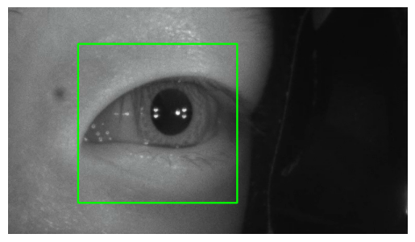
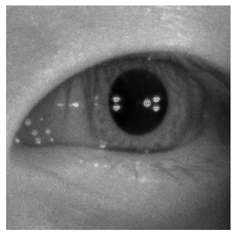
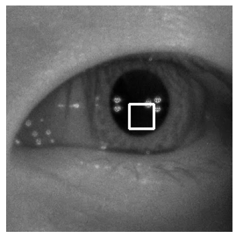
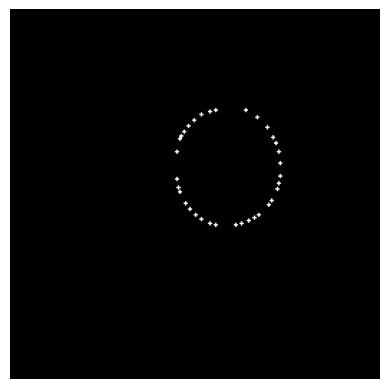
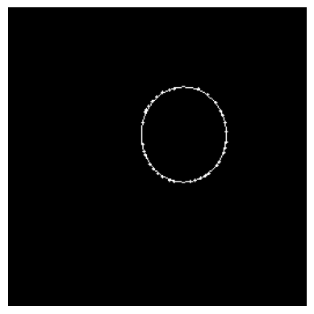
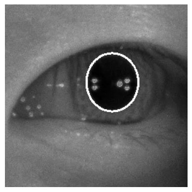
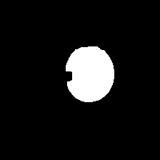

# Eye Tracking

## Table of Contents

- [Setup](#setup)
- [The Algorithm – Used to Label Data](#the-algorithm--used-to-label-data)  
  - [1. Coarse Localization](#1-coarse-localization)  
  - [2. Preprocessing](#2-preprocessing)  
  - [3. Pupil Color Estimation](#3-pupil-color-estimation)  
  - [4. Multi-Threshold Segmentation](#4-multi-threshold-segmentation)  
  - [5. Contour Extraction](#5-contour-extraction)  
  - [6. Ellipse Regression](#6-ellipse-regression)  
  - [7. Ellipse Selection](#7-ellipse-selection)  
  - [8. Temporal Smoothing](#8-temporal-smoothing)  
- [CNN Overview](#cnn-overview)  
- [Data Preparation & Augmentation](#data-preparation--augmentation)  
- [CNN Training](#cnn-training)  
  - [Encoder (Feature Compression)](#encoder-feature-compression)  
  - [Decoder (Upsampling)](#decoder-upsampling)  
  - [Output Layer](#output-layer)  
- [Inference](#inference)  
- [Notes](#notes)  
  - [Training Configuration](#training-configuration)  
  - [Key Observations](#key-observations)  
  - [Model Versions](#model-versions)  

---

## Setup

**Required**

- `opencv`
- `tensorflow`
- `onnxruntime`
- `haarcascade_eye.xml`

---

## The Algorithm – Used to Label Data

### 1. Coarse Localization

Using OpenCV’s pretrained Haar Cascade classifiers ([link](https://docs.opencv.org/3.4/db/d28/tutorial_cascade_classifier.html)), the frame is cropped to focus on the eye region. This reduces the search space and significantly lowers complexity.

---

### 2. Preprocessing

- Crop the eye region  
- Remove bright glints via thresholding  
- Convert to grayscale  
- Apply Gaussian blur to suppress noise  

---

### 3. Pupil Color Estimation

Assuming the pupil is the darkest region in the cropped eye image, we perform a grid search to locate the darkest square region and use its average intensity as a threshold baseline for binarization.

**Grid Search Calculation:**  
Let the image be divided into NxN grid cells, and let $`G_{i,j}`$ be the set of pixel intensities in the cell at row $`i`$, column $`j`$. Then, the mean intensity $`\mu_{i,j}`$ of each cell is:

$`\mu_{i,j} = \frac{1}{|G_{i,j}|} \sum_{(x,y) \in G_{i,j}} I(x, y)`$

The **darkest region** is found by:

$`\mu_{i,j} = \frac{1}{|G_{i,j}|} \sum_{(x,y) \in G_{i,j}} I(x, y)`$

The value $`\mu_{i^*, j^*}`$ becomes the **dark baseline threshold** for later steps.

---

### 4. Multi-Threshold Segmentation

The image is thresholded at multiple values offset from the dark baseline. This helps handle lighting variability and different pupil contrasts across frames. Each thresholded image highlights possible pupil candidates.

**Binary Thresholding Function:**  
Let $`I(x, y)`$ be the grayscale intensity at pixel $`(x, y)`$, and $`T`$ be the threshold value (e.g., dark baseline + 21). Then the binarized image $`B(x, y)`$ is:

$`B(x, y) = \begin{cases} 255 & \text{if } I(x, y) < T \\ 0   & \text{otherwise} \end{cases}`$

Example: Image thresholded at baseline + 21

---

### 5. Contour Extraction

Contours are extracted from each thresholded image. Small contours and those touching the image edge are discarded. The result is a point cloud approximating the pupil boundary.

---

### 6. Ellipse Regression

Using least squares regression, we fit an ellipse to the point cloud of contour points. To handle upper eyelid occlusion, we duplicate and reflect points from the lower half (below the y-mean), biasing the fit toward the more visible bottom contour.

Let the original contour points be:
$`P = \{ (x_i, y_i) \mid i = 1 \ldots N \}`$

1. Compute the average $`y`$-value (vertical midpoint):

$`\bar{y} = \frac{1}{N} \sum_{i=1}^{N} y_i`$

2. Select points below this line:

$`P_{\text{bottom}} = \{ (x_i, y_i) \in P \mid y_i > \bar{y} \}`$

3. Reflect each bottom point across $`y = \bar{y}`$:

$`(x_i, y_i) \mapsto (x_i, 2\bar{y} - y_i)`$

4. Combine original and reflected:

$`P' = P \cup \{\text{reflected }P_{\text{bottom}}\}`$

This biases the ellipse fit toward the more reliable lower contour.

**Ellipse Fitting Equation:**  

$`A x^2 + B x y + C y^2 + D x + E y + F = 0`$

Parameters minimize:

$`\sum_{(x_i,y_i)\in P'} (A x_i^2 + B x_i y_i + C y_i^2 + D x_i + E y_i + F)^2`$

subject to:

$`B^2 - 4AC < 0`$

---

### 7. Ellipse Selection

To choose the best ellipse, we score each candidate based on how well it fits the thresholded pupil image. The score is based on two components:

1. **Inside White Ratio**  

$`\text{Inside Ratio} = \frac{\text{White pixels inside ellipse}}{\text{Total pixels inside ellipse}}`$

2. **Outside Black Ratio**  

$`\text{Outside Ratio} = \frac{\text{Black pixels outside ellipse}}{\text{Total pixels outside ellipse}}`$

3. **Final Score (Heuristic)**  

$`\text{Score} = \text{Inside Ratio} + 0.25 \times \text{Outside Ratio}`$

---

### 8. Temporal Smoothing

To ensure smooth and consistent tracking across frames, the algorithm applies:

1. **Change Rejection**  
   If the newly detected ellipse differs too much (position, size, aspect ratio or rotation) from the previous one, it is discarded and the previous ellipse is reused.

2. **Exponential Moving Average (EMA)**  
   Let:
   - $`E_t`$ be the ellipse parameters at frame $`t`$  
   - $`\alpha`$ be the smoothing factor (between 0 and 1)  
   - $`\mathrm{EMA}_t`$ be the smoothed value at frame $`t`$  

   Update rule:

$`\mathrm{EMA}_t = \alpha \, E_t + (1 - \alpha)\, \mathrm{EMA}_{t-1}`$

Over time:

$`\mathrm{EMA}_t = \alpha E_t + \alpha(1 - \alpha) E_{t-1} + \alpha(1 - \alpha)^2 E_{t-2} + \dots`$

This reduces jitter and maintains temporal consistency.

---

## CNN Overview

We aim to train a Convolutional Neural Network (CNN) to segment the pupil directly from the image, avoiding classical image processing. This improves **portability**, **stability**, and **generalization**, while allowing **data augmentation** to catch edge cases.

Given an input image (left), the network should produce a segmentation mask (right):

---

## Data Preparation & Augmentation

1. `video2frames.py` extracts frames from videos in `videos/` → `frames/`  
2. `generate_masks.py` processes each frame to generate:  
   - Input image → `images/`  
   - Segmentation mask → `best_masks/`  

Note: Training videos are stored in H drive under 'PupilVids'

Each image-mask pair is duplicated and augmented with:
- Brightness adjustment  
- Contrast enhancement  
- Pupil Occlusion
- Gaussian blur  
- Gamma correction  
- Rotation  

This results in ~550k image mask pairs for training. Given the simplicity of the model architecture this is more than enough data.

---

## CNN Training

A scaled-down [SegNet model](https://www.geeksforgeeks.org/computer-vision/segnet-a-deep-convolutional-encoder-decoder-architecture-for-image-segmentation/) is used. Training is in `CNN.ipynb`.

- **Input:** 128×128 grayscale image (`(128, 128, 1)`)  
- **Normalization:** Pixel values scaled to [0,1]  
- **Loss:** Binary Cross-Entropy  
  $`{BCE Loss} = -\frac{1}{N} \sum_{i=1}^{N} [y_i \log(\hat{y}_i) + (1 - y_i) \log(1 - \hat{y}_i)]`$
- **Optimization:** Adam (default params)
- **Batch size:** 32  
- **Epochs:** 15  
- **Loss:** 0.0304 
- **Accuracy:** ~98.3% after training

## Observations

- Directly fitting an ellipse with CNN is more expensive and prone to jitter
- Dataset generation works faster on computers with faster CPU, caching, and RAM
- Model architecture can be made more complex for more feature extraction but adding another layer reduces fps ~50%
- Model trained on augmented data outperforms classical algorithms in challenging conditions
- In benchmark of 2000 labeled and hand checked images mean Euclidean distance error decreased from 46.79px to 24.33px (73% area reduction) while running 60FPS

## Model Notes

- Model 1: Base architecture with augmentation, trained on 220 k images.
- Model 2: Base architecture applied to Alex G dataset, 550 k images, fixed floating-
- point rounding error.
- Model 3: Experimental larger architecture; scrapped due to poor performance on the
left eye.
- Model 4: Larger architecture for enhanced feature extraction, trained on 550 k images;
achieved 24.33 px error, but underperformed on the “Denis eye”
- Model 5: Base architecture with convex hull pretraining, trained on 550 k images;
- Model 6: Augmentation for pupil occlusion scenarios; dataset limited to 550 k im-
ages due to RAM constraints. Trained on the first 500 k images; planned to reduce
augmentation set.
- Model 7: Removed redundant augmentations to free memory for future data expansion

## Future Considerations

- If exposure time and illumination are going to be changed, values for brightness augmentation will need to cover that new range
- The best way to fix tracking for certain case is to augment

-Nate

